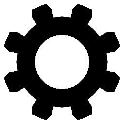

<h1 align="center">
Hi, I'm Fabio Cardona!
    
    
</h1>

## <b> About me</b>

- 📖 Studying at Distrital University in Bogota, Colombia 💛💙❤️
- 🌱 Learning about AI, advanced algorithms, and improving my skills in modern web frameworks
- 🤝 Looking to collaborate on innovative software projects, especially in web and games development
- 🐧 I'd like to work in software development with a company where I can learn
- 🤩 I feel motivated working on projects that could improve my personal and professional skills
 
 

## <b> Connect with me</b>

    
    

 
 
 

## <b> Skills</b>

    
    

        
Languajes

        
        
        
        
        
        
        
         
         
        
Frameworks

        
        
        
        
        
    

 
 
 

## <b> Github Analytics</b>

    
    

 

---

Credits: [Fabio Cardona](https://github.com/FabiusC)

Last Edited on: 08/09/2024
